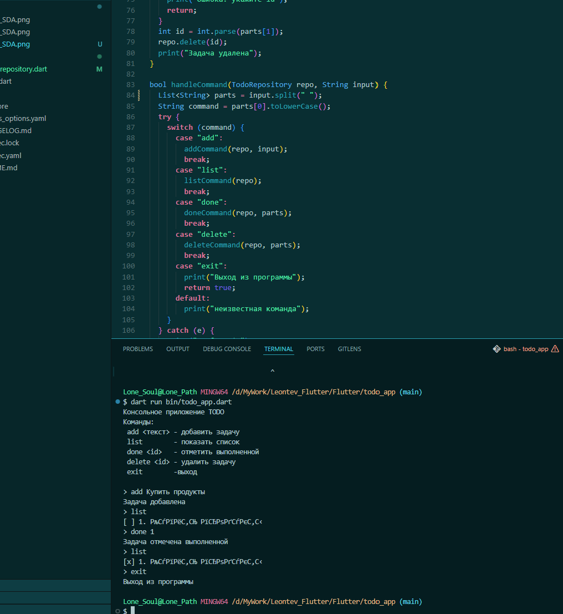

# Лабораторная работа №1: Быстрое погружение в язык Dart

## Описание
Консольное приложение ToDo, разработанное на языке Dart. Проект демонстрирует основы синтаксиса Dart, работу с типами данных (включая Null Safety), объектно-ориентированное программирование, а также использование асинхронности (`async/await`) и сторонних пакетов (`ansicolor`) для оформления вывода в терминале.

## Информация об авторе
- **Студент:** SDA
- **Группа:** ISP-232

## Скриншот приложения


> *Примечание: Если изображение не отображается, убедитесь, что файл скриншота находится в папке `img/` и имя файла совпадает с указанным выше.*

## Как запустить проект

### Требования
- Установленный **Dart SDK** версии 3.0 или выше.
- Терминал (Git Bash, PowerShell, Terminal).

### Инструкция по запуску

1. **Клонирование репозитория:**
   ```bash
   git clone <URL_ВАШЕГО_РЕПОЗИТОРИЯ>
   cd todo_app
   ```

2. **Установка зависимостей:**
   Выполните команду для загрузки необходимых пакетов (включая `ansicolor`):
   ```bash
   dart pub get
   ```

3. **Запуск приложения:**
   ```bash
   dart run bin/todo_app.dart
   ```

4. **Использование:**
   После запуска следуйте инструкциям в меню:
   - `add <текст задачи>` — добавить новую задачу.
   - `list` — показать список всех задач.
   - `done <id>` — отметить задачу как выполненную.
   - `delete <id>` — удалить задачу по ID.
   - `exit` — выйти из приложения.

## Что изучено в ходе работы

1. **Основы языка Dart:** Синтаксис, вывод типов (`var`), неизменяемые переменные (`final` vs `const`) и строгая нулевая безопасность (Null Safety).
2. **ООП в Dart:** Создание классов, использование именованных конструкторов, переопределение методов (`toString`), модификаторы доступа через подчеркивание (`_`).
3. **Работа с коллекциями и исключениями:** Использование `List`, `Map`, обработка ошибок через `try-catch` и выброс исключений (`ArgumentError`).
4. **Асинхронность:** Понимание принципов работы `Future`, `async` и `await`, отличие неблокирующего ожидания от потоков.
5. **Управление пакетами:** Подключение внешних библиотек через `pub.dev` (на примере пакета `ansicolor` для цветного вывода).

---

## Ответы на контрольные вопросы

**1. Чем `final` отличается от `const` в Dart?**
*   `final`: Значение переменной определяется во время выполнения программы (runtime) и может быть вычислено динамически. Присвоить значение можно только один раз.
*   `const`: Значение должно быть известно на этапе компиляции (compile-time). Это константа времени компиляции. Объект, созданный как `const`, является канонизированным (одинаковые константы указывают на один объект в памяти).

**2. Что означает `String?`?**
Это обозначение типа с поддержкой Null Safety. `String?` означает, что переменная может содержать либо строку (`String`), либо значение `null`. В отличие от простого `String`, который гарантированно не может быть `null`.

**3. Чем `Future` отличается от обычного значения? Что означает `await` с точки зрения потока выполнения?**
*   `Future` представляет собой отложенный результат асинхронной операции. В отличие от обычного значения, которое доступно сразу, `Future` будет завершено (успешно или с ошибкой) в будущем.
*   `await` приостанавливает выполнение *текущей асинхронной функции*, освобождая поток выполнения (Event Loop) для обработки других задач. Это неблокирующее ожидание: программа не "зависает", а продолжает работать, пока не придет результат от `Future`.

**4. Зачем в Dart именованные конструкторы, если в C# есть перегрузка?**
В Dart нет перегрузки методов и конструкторов по сигнатуре (разному набору параметров). Чтобы иметь несколько способов создания объекта с разными параметрами, используются именованные конструкторы (например, `ClassName.named()`). Это делает код более читаемым и явным, особенно при использовании большого количества опциональных параметров, что активно применяется во Flutter.
